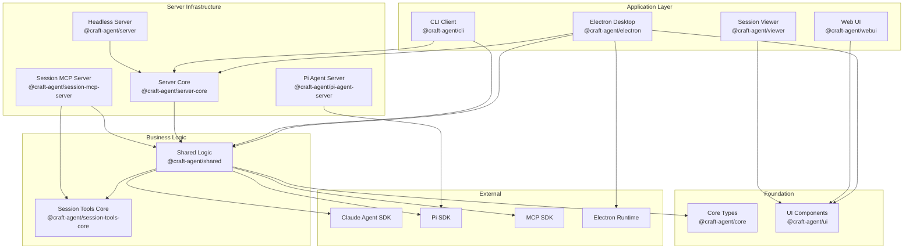
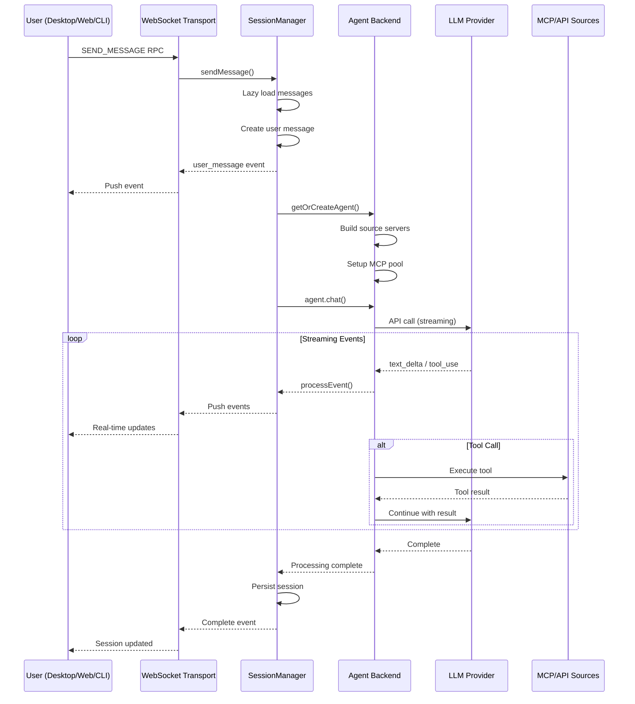
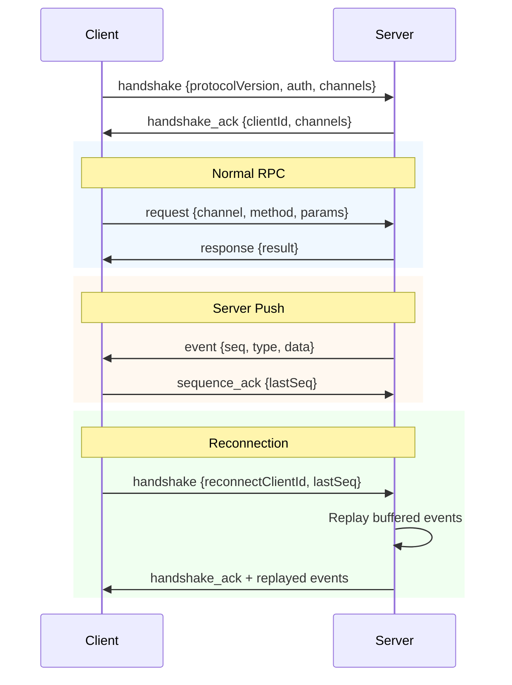
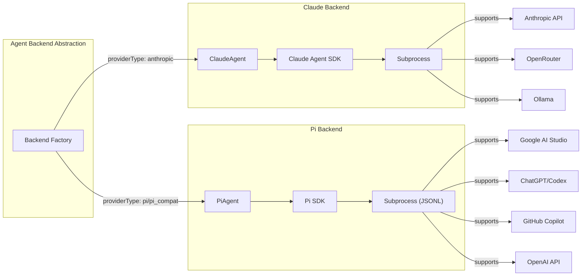
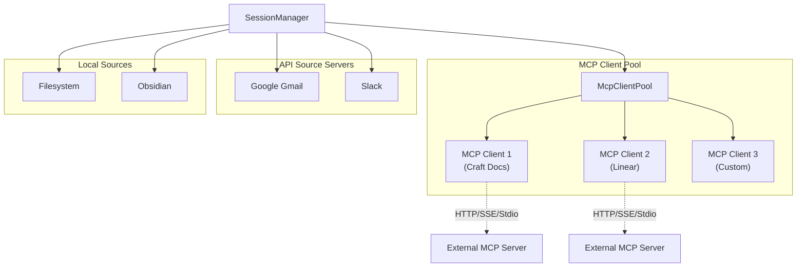
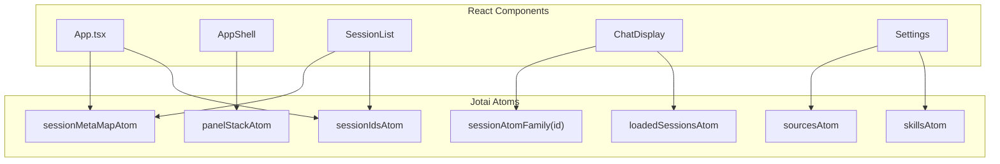

# 05 - 系统架构

## 架构概览

Craft Agents 采用 **Monorepo + 分层架构** 设计，分为 Foundation、Business Logic、Server Infrastructure、Application 四层。

## 核心数据流

### 消息处理流程

### WebSocket RPC 协议

## 模块职责

### packages/core — 基础类型
| 职责 | 内容 |
|------|------|
| 类型定义 | Workspace, Session, Message, Attachment, Annotation 等所有核心类型 |
| 枚举 | SessionStatus, MessageRole, ErrorCode, PermissionRequestType 等 |
| 工具函数 | debug 日志, 路径工具 |
| 无依赖 | 不依赖任何内部包，纯类型包 |

### packages/shared — 核心业务逻辑
| 模块 | 职责 |
|------|------|
| `agent/` | Agent 后端抽象 (Claude/Pi)、权限管理、提示构建 |
| `auth/` | OAuth 流程 (Claude/Google/Microsoft/Slack/ChatGPT) |
| `config/` | 全局配置、LLM 连接、主题、存储迁移 |
| `credentials/` | AES-256-GCM 加密凭据管理 |
| `labels/` | 层级标签系统 + 自动标签规则 |
| `mcp/` | MCP 客户端池，集中管理所有 MCP 连接 |
| `protocol/` | WebSocket RPC 协议类型 |
| `sessions/` | 会话持久化 (JSONL)，类型定义 |
| `sources/` | 源存储、类型、API 工具构建器 |
| `statuses/` | 可配置会话状态系统 |
| `workspaces/` | 工作区存储和类型 |

### packages/server-core — 服务器基础设施
| 模块 | 职责 |
|------|------|
| `transport/` | WebSocket RPC 服务器、协议编解码、事件推送 |
| `bootstrap/` | 服务器启动流程 (PID锁、Token验证、Handler注册) |
| `handlers/` | RPC 通道处理器 (sessions, sources, skills 等) |
| `sessions/` | SessionManager — 会话生命周期、Agent 管理、消息处理 |
| `model-fetchers/` | 多提供商模型列表刷新服务 |
| `webui/` | Web UI HTTP 处理器 |

### apps/electron — 桌面应用
| 层 | 职责 |
|-----|------|
| `main/` | Electron 主进程：窗口管理、IPC、浏览器自动化、托盘 |
| `preload/` | Context Bridge：WebSocket RPC 客户端 + OAuth 流程 |
| `renderer/` | React UI：三栏布局、会话列表、聊天界面、设置页面 |

## Agent 后端架构

## MCP 客户端池架构

## 前端状态管理

## 待确认项

| ID | 内容 | 置信度 | 建议操作 |
|----|------|--------|----------|
| TC-501 | MCP 客户端池的连接数上限 | ⚠️ [待确认] | 确认并发 MCP 连接限制 |
| TC-502 | 消息处理的吞吐量限制 | ⚠️ [待确认] | 确认高并发场景下的性能 |
