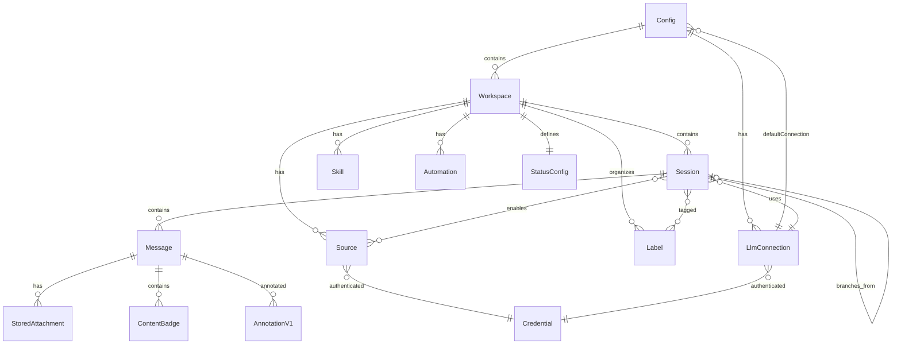

# 06 - 数据模型

## 核心实体关系



## 核心实体定义

### Config (全局配置)

**存储位置**: `~/.craft-agent/config.json`

| 字段 | 类型 | 描述 |
|------|------|------|
| `llmConnections` | LlmConnection[] | LLM 连接列表 |
| `defaultLlmConnection` | string | 默认连接 slug |
| `defaultThinkingLevel` | string | 默认思考级别 |
| `workspaces` | Workspace[] | 工作区列表 |
| `activeWorkspaceId` | string \| null | 当前活跃工作区 |
| `activeSessionId` | string \| null | 当前活跃会话 |
| `colorTheme` | string | 颜色主题 |
| `authType` | AuthType | 认证方式 |
| `serverConfig` | object | 远程服务器配置 |
| `networkProxy` | object | 网络代理配置 |

### Workspace (工作区)

**存储位置**: `~/.craft-agent/workspaces/{id}/`

| 字段 | 类型 | 描述 |
|------|------|------|
| `id` | string | 唯一标识符 |
| `name` | string | 工作区名称 |
| `slug` | string | URL 友好标识 |
| `rootPath` | string | 本地绝对路径 |
| `createdAt` | number | 创建时间戳 |
| `iconUrl` | string | 图标 URL |
| `mcpUrl` | string | MCP 服务端 URL |
| `defaults` | object | 默认配置 (模型/权限/源/思考级别) |
| `remoteServer` | RemoteServerConfig | 远程服务器配置 |

### Session (会话)

**存储位置**: `{workspaceRoot}/sessions/{id}/session.jsonl`

| 字段 | 类型 | 描述 |
|------|------|------|
| `id` | string | 唯一标识符 (UUID) |
| `workspaceId` | string | 所属工作区 |
| `sdkSessionId` | string | SDK 层会话 ID |
| `name` | string | 会话名称 |
| `permissionMode` | 'safe' \| 'ask' \| 'allow-all' | 权限模式 |
| `status` | string | 状态 ID (引用工作区状态配置) |
| `model` | string | 使用的模型 ID |
| `llmConnection` | string | LLM 连接 slug |
| `thinkingLevel` | string | 思考级别 |
| `enabledSourceSlugs` | string[] | 启用的源列表 |
| `isArchived` | boolean | 是否归档 |
| `isFlagged` | boolean | 是否标记 |
| `lastReadMessageId` | string | 最后已读消息 ID |
| `tokenUsage` | TokenUsage | Token 使用量 |
| `messages` | Message[] | 消息列表 (懒加载) |
| `createdAt` | number | 创建时间 |
| `lastUsedAt` | number | 最后使用时间 |
| `branchFromMessageId` | string | 分支来源消息 ID |
| `pendingPlanExecution` | object | 待执行计划 |
| `triggeredBy` | object | 自动化触发元数据 |

**JSONL 存储格式**:
```
Line 1: SessionHeader (预计算元数据)
Line 2+: StoredMessage (逐条消息)
```

### Message (消息)

| 字段 | 类型 | 描述 |
|------|------|------|
| `id` | string | 消息 ID |
| `role` | MessageRole | 角色 (user/assistant/tool/error/status/info/warning/plan/auth-request) |
| `content` | string | 消息内容 |
| `timestamp` | number | 时间戳 |
| `toolName` | string | 工具名称 (工具消息) |
| `toolInput` | any | 工具输入参数 |
| `toolResult` | any | 工具执行结果 |
| `toolStatus` | ToolStatus | 工具状态 |
| `toolDuration` | number | 执行耗时 (ms) |
| `attachments` | Attachment[] | 文件附件 |
| `badges` | ContentBadge[] | @提及徽章 |
| `errorCode` | ErrorCode | 错误代码 |
| `isStreaming` | boolean | 是否正在流式传输 |
| `isError` | boolean | 是否错误消息 |
| `taskId` | string | 后台任务 ID |

### Source (源)

**存储位置**: `{workspaceRoot}/sources/{slug}/`

| 字段 | 类型 | 描述 |
|------|------|------|
| `type` | 'mcp' \| 'api' \| 'local' | 源类型 |
| `slug` | string | URL 友好标识 |
| `name` | string | 显示名称 |
| `provider` | string | 提供商标识 (google/microsoft/linear 等) |
| `config` | SourceConfig | 类型特定配置 |
| `enabled` | boolean | 是否启用 |

**SourceConfig 按类型区分**:

| MCP 源 | API 源 | 本地源 |
|--------|--------|--------|
| `url` / `command` / `args` | `apiService` / `endpoints` | `path` |
| `transport`: http/sse/stdio | `authType`: bearer/oauth/... | `format`: hint |
| `auth`: oauth/bearer/none | `oauthConfig` | |
| `env` / `headers` | `baseUrl` / `headerNames` | |

### LlmConnection (LLM 连接)

| 字段 | 类型 | 描述 |
|------|------|------|
| `slug` | string | 唯一标识 |
| `name` | string | 显示名称 |
| `providerType` | 'anthropic' \| 'pi' \| 'pi_compat' | 后端类型 |
| `authType` | string | 认证方式 |
| `model` | string | 默认模型 |
| `models` | string[] | 可用模型列表 |
| `baseUrl` | string | 自定义端点 URL |
| `piAuthProvider` | string | Pi 认证提供者 |

### Credential (凭据)

**存储位置**: `~/.craft-agent/credentials.enc` (AES-256-GCM 加密)

**Key 格式**: `{type}::{scope}`

| 类型 | 范围 | 示例 Key |
|------|------|----------|
| `llm_api_key` | 连接 slug | `llm_api_key::anthropic-api` |
| `llm_oauth` | 连接 slug | `llm_oauth::claude-max` |
| `source_oauth` | workspace::source | `source_oauth::{wsId}::{srcId}` |
| `source_bearer` | workspace::source | `source_bearer::{wsId}::{srcId}` |
| `workspace_oauth` | workspace ID | `workspace_oauth::{wsId}` |

### StatusConfig (状态配置)

**存储位置**: `{workspaceRoot}/statuses/config.json`

| 字段 | 类型 | 描述 |
|------|------|------|
| `id` | string | 状态 ID |
| `label` | string | 显示名称 |
| `color` | EntityColor | 颜色 |
| `icon` | string | 图标 |
| `category` | 'open' \| 'closed' | 类别 |
| `isDefault` | boolean | 是否默认 |
| `order` | number | 排序 |

### TokenUsage (Token 用量)

| 字段 | 类型 | 描述 |
|------|------|------|
| `inputTokens` | number | 输入 Token 数 |
| `outputTokens` | number | 输出 Token 数 |
| `totalTokens` | number | 总 Token 数 |
| `contextTokens` | number | 上下文 Token 数 |
| `costUsd` | number | 花费 (美元) |
| `cacheReadTokens` | number | 缓存读取 Token |
| `cacheCreationTokens` | number | 缓存创建 Token |

### Automation (自动化)

**存储位置**: `{workspaceRoot}/automations.json`

| 字段 | 类型 | 描述 |
|------|------|------|
| `version` | number | 配置版本 |
| `automations` | Record<EventType, Rule[]> | 事件 → 规则映射 |
| `Rule.cron` | string | Cron 表达式 (SchedulerTick) |
| `Rule.matcher` | string | 正则匹配 (LabelAdd/Remove) |
| `Rule.actions` | Action[] | 触发的动作列表 |

## 枚举定义

### MessageRole
```typescript
'user' | 'assistant' | 'tool' | 'error' | 'status' |
'info' | 'warning' | 'plan' | 'auth-request'
```

### SessionStatus (内置)
```typescript
'todo' | 'in_progress' | 'needs_review' | 'done' | 'cancelled'
```

### ErrorCode
```typescript
'invalid_api_key' | 'invalid_credentials' | 'response_too_large' |
'expired_oauth_token' | 'token_expired' | 'rate_limited' |
'service_error' | 'service_unavailable' | 'network_error' |
'proxy_error' | 'mcp_auth_required' | 'mcp_unreachable' |
'billing_error' | 'model_no_tool_support' | 'invalid_model' |
'data_policy_error' | 'invalid_request' | 'image_too_large' |
'provider_error' | 'unknown_error'
```

### PermissionMode
```typescript
'safe' | 'ask' | 'allow-all'
```

## 待确认项

| ID | 内容 | 置信度 | 建议操作 |
|----|------|--------|----------|
| TC-601 | 数据库迁移策略 | ⚠️ [待确认] | JSONL 格式是否需要版本迁移 |
| TC-602 | 会话大小上限 | ⚠️ [待确认] | 单个会话文件的最大大小 |
