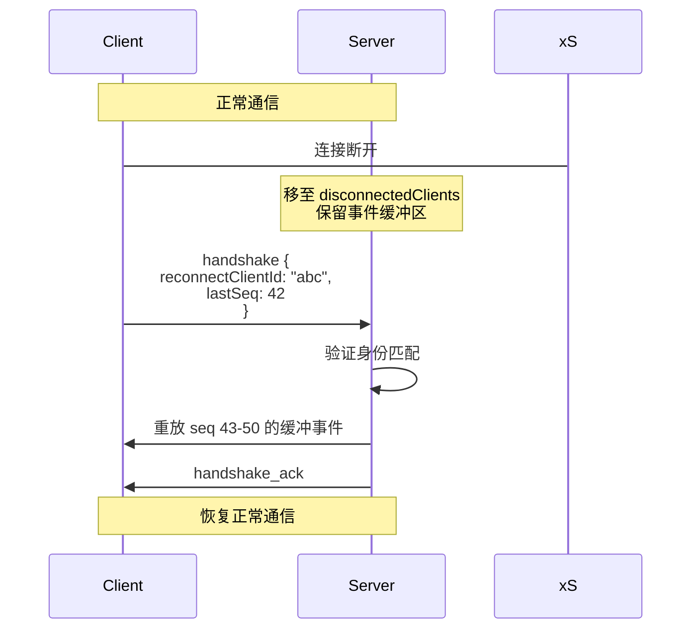

# 07 - API 接口设计

## 通信协议

Craft Agents 使用 **WebSocket RPC** 协议进行客户端-服务器通信，自定义二进制帧格式。

### 协议版本

当前版本在握手阶段协商，服务端验证客户端 `protocolVersion`。

---

## 消息信封 (Message Envelope)

所有通信使用 `MessageEnvelope` 对象，通过 WebSocket 二进制帧传输：

| 类型 | 方向 | 描述 |
|------|------|------|
| `handshake` | Client → Server | 连接握手（含协议版本、认证、通道注册） |
| `handshake_ack` | Server → Client | 握手确认（含 clientId、通道确认） |
| `request` | Client → Server | RPC 请求 |
| `response` | Server → Client | RPC 响应 |
| `event` | Server → Client | 服务端推送事件 |
| `sequence_ack` | Client → Server | 事件确认（允许服务端释放缓冲区） |
| `error` | 双向 | 协议级错误 |

---

## RPC 通道

### 会话通道

| 通道 | 方法 | 描述 |
|------|------|------|
| `sessions:list` | - | 列出工作区会话 |
| `sessions:get` | `{sessionId}` | 获取会话详情（含消息） |
| `sessions:create` | `{name, mode, ...}` | 创建新会话 |
| `sessions:delete` | `{sessionId}` | 删除会话 |
| `sessions:sendMessage` | `{sessionId, content, ...}` | 发送消息（不等待完成） |
| `sessions:update` | `{sessionId, ...fields}` | 更新会话字段 |
| `sessions:rename` | `{sessionId, name}` | 重命名会话 |
| `sessions:setStatus` | `{sessionId, status}` | 设置会话状态 |
| `sessions:setFlag` | `{sessionId, flagged}` | 设置标记 |
| `sessions:archive` | `{sessionId}` | 归档会话 |
| `sessions:branch` | `{sessionId, messageId}` | 从消息分支 |
| `sessions:cancel` | `{sessionId}` | 取消进行中的处理 |
| `sessions:setMode` | `{sessionId, mode}` | 设置权限模式 |
| `sessions:setModel` | `{sessionId, model}` | 设置模型 |
| `sessions:setThinkingLevel` | `{sessionId, level}` | 设置思考级别 |

### 源通道

| 通道 | 方法 | 描述 |
|------|------|------|
| `sources:list` | - | 列出工作区源 |
| `sources:get` | `{slug}` | 获取源详情 |
| `sources:create` | `{...sourceConfig}` | 创建源 |
| `sources:delete` | `{slug}` | 删除源 |
| `sources:test` | `{slug}` | 测试源连接 |
| `sources:setEnabled` | `{slug, enabled}` | 启用/禁用源 |
| `sources:updateToolConfig` | `{slug, ...}` | 更新源工具配置 |

### 技能通道

| 通道 | 方法 | 描述 |
|------|------|------|
| `skills:list` | - | 列出工作区技能 |
| `skills:get` | `{slug}` | 获取技能详情 |
| `skills:create` | `{...skillConfig}` | 创建技能 |
| `skills:delete` | `{slug}` | 删除技能 |
| `skills:update` | `{slug, ...}` | 更新技能 |

### 自动化通道

| 通道 | 方法 | 描述 |
|------|------|------|
| `automations:list` | - | 列出自动化规则 |
| `automations:create` | `{...automation}` | 创建自动化 |
| `automations:delete` | `{id}` | 删除自动化 |
| `automations:update` | `{id, ...}` | 更新自动化 |

### 工作区通道

| 通道 | 方法 | 描述 |
|------|------|------|
| `workspaces:list` | - | 列出工作区 |
| `workspaces:get` | `{id}` | 获取工作区详情 |
| `workspaces:create` | `{name, ...}` | 创建工作区 |
| `workspaces:delete` | `{id}` | 删除工作区 |
| `workspaces:switch` | `{id}` | 切换活跃工作区 |
| `workspaces:update` | `{id, ...}` | 更新工作区配置 |

### 配置通道

| 通道 | 方法 | 描述 |
|------|------|------|
| `config:get` | - | 获取全局配置 |
| `config:update` | `{...fields}` | 更新全局配置 |
| `credentials:store` | `{key, value}` | 存储凭据 |
| `credentials:get` | `{key}` | 获取凭据 |
| `credentials:delete` | `{key}` | 删除凭据 |
| `credentials:health` | - | 检查凭据存储健康 |

### LLM 连接通道

| 通道 | 方法 | 描述 |
|------|------|------|
| `connections:list` | - | 列出 LLM 连接 |
| `connections:create` | `{...connection}` | 创建连接 |
| `connections:delete` | `{slug}` | 删除连接 |
| `connections:update` | `{slug, ...}` | 更新连接 |
| `connections:test` | `{slug}` | 测试连接 |
| `connections:models` | `{slug}` | 获取可用模型 |

### 系统通道

| 通道 | 方法 | 描述 |
|------|------|------|
| `system:ping` | - | 连通性检查 |
| `system:health` | - | 健康检查 |
| `system:versions` | - | 版本信息 |
| `system:themes` | - | 主题列表 |
| `system:shellOpen` | `{type, path}` | 打开文件/URL |

---

## 服务端推送事件

事件通过 `event` 信封推送，支持三种目标：

| 目标 | 描述 |
|------|------|
| `all` | 广播给所有客户端 |
| `workspace:{id}` | 工作区内的客户端 |
| `client:{id}` | 特定客户端 |

### 事件类型

| 事件 | 描述 |
|------|------|
| `user_message` | 新用户消息 |
| `text_delta` | 流式文本片段 |
| `tool_start` | 工具开始执行 |
| `tool_result` | 工具执行结果 |
| `processing_complete` | Agent 处理完成 |
| `processing_error` | 处理错误 |
| `permission_request` | 权限审批请求 |
| `credential_request` | 凭据请求 |
| `auth_request` | OAuth 认证请求 |
| `plan_submitted` | 计划提交 |
| `session_updated` | 会话元数据更新 |
| `background_task` | 后台任务状态更新 |
| `model_list_updated` | 模型列表刷新 |

---

## 认证

### Bearer Token 认证 (CLI / 桌面瘦客户端)
```
handshake {
  auth: { token: "bearer:<server-token>" }
}
```

### Cookie 认证 (Web UI)
```
POST /api/auth { token: "<server-token>" }
→ Set-Cookie: session=<signed-cookie>

WebSocket upgrade 自动携带 Cookie
```

---

## HTTP 端点 (Web UI 嵌入)

| 端点 | 方法 | 描述 |
|------|------|------|
| `/api/auth` | POST | Token 认证，设置 Session Cookie |
| `/api/config` | GET | 获取 WebSocket URL（需认证） |
| `/api/config/workspaces` | GET | 获取默认工作区 |
| `/api/health` | GET | 健康检查 |

---

## 断线重连



## 待确认项

| ID | 内容 | 置信度 | 建议操作 |
|----|------|--------|----------|
| TC-701 | RPC 通道是否完整 | ⚠️ [待确认] | 确认是否有未列出的通道 |
| TC-702 | HTTP API 完整性 | ⚠️ [待确认] | 确认 WebUI 专用端点 |
