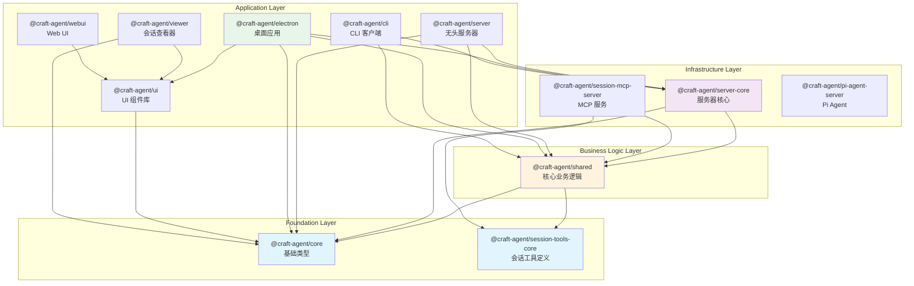

# 08 - 依赖关系

## 内部包依赖图



## 包依赖矩阵

| 包 | 依赖的内部包 | 外部关键依赖 |
|----|-------------|-------------|
| `core` | (无) | TypeScript 类型 |
| `session-tools-core` | (无) | zod, beautiful-mermaid, gray-matter |
| `shared` | core, session-tools-core | claude-agent-sdk, pi-ai/sdk, mcp-sdk, croner, i18next |
| `server-core` | core, shared | ws, sharp, jose |
| `server` | core, server-core, shared | (无额外) |
| `session-mcp-server` | session-tools-core, shared | @modelcontextprotocol/sdk, zod |
| `pi-agent-server` | (无内部) | pi-coding-agent, pi-ai, duck-duck-scrape |
| `ui` | core | react, radix-ui, shiki, beautiful-mermaid |
| `electron` | core, server-core, shared, ui | electron, react, radix-ui, tiptap, jotai, sentry |
| `viewer` | core, ui | react, react-dom |
| `webui` | (通过共享 UI 间接) | react-i18next |
| `cli` | shared, server-core | (无额外) |

## 关键外部依赖

### AI/ML 相关
| 依赖 | 版本 | 用途 |
|------|------|------|
| `@anthropic-ai/claude-agent-sdk` | ^0.2.78 | Claude Agent 后端 |
| `@mariozechner/pi-ai` | ^0.66.1 | Pi AI 基础 |
| `@mariozechner/pi-coding-agent` | ^0.66.1 | Pi 编码 Agent |
| `@github/copilot-sdk` | ^0.1.23 | GitHub Copilot 集成 |
| `@modelcontextprotocol/sdk` | ^1.24.3 | MCP 协议 |
| `openai` | ^6.18.0 | OpenAI API |

### UI 相关
| 依赖 | 版本 | 用途 |
|------|------|------|
| `react` | ^18.3.1 | UI 框架 |
| `@radix-ui/*` | 多个 | 无障碍 UI 组件 |
| `@tiptap/*` | ^3.20.0 | 富文本编辑器 |
| `tailwindcss` | ^4.1.18 | CSS 框架 |
| `lucide-react` | ^0.561.0 | 图标库 |
| `shiki` | ^3.19.0 | 代码语法高亮 |
| `jotai` | ^2.16.0 | 状态管理 |

### 桌面/构建相关
| 依赖 | 版本 | 用途 |
|------|------|------|
| `electron` | ^39.2.7 | 桌面框架 |
| `electron-builder` | ^26.0.12 | 打包工具 |
| `vite` | ^6.2.4 | 前端构建 |
| `esbuild` | ^0.25.0 | 主进程构建 |

### 安全/加密
| 依赖 | 版本 | 用途 |
|------|------|------|
| `jose` | (server-core) | JWT/JWE/JWS |
| `zod` | ^4.0.0 | Schema 验证 |

### 工具链
| 依赖 | 版本 | 用途 |
|------|------|------|
| `bun` | latest | 运行时/包管理 |
| `typescript` | ^5.0.0 | 类型系统 |
| `@sentry/*` | 多个 | 错误监控 |

## 层级架构依赖规则

```
Foundation (core, session-tools-core)
    ↑ 可被任何层依赖
    ↓ 不依赖任何内部包

Business Logic (shared)
    ↑ 依赖 Foundation
    ↓ 被 Infrastructure 和 Application 依赖

Infrastructure (server-core, session-mcp-server, pi-agent-server)
    ↑ 依赖 Foundation + Business Logic
    ↓ 被 Application 依赖

Application (server, electron, cli, viewer, webui)
    ↑ 依赖任意下层
    ↓ 不被任何内部包依赖
```

## 待确认项

| ID | 内容 | 置信度 | 建议操作 |
|----|------|--------|----------|
| TC-801 | Pi Agent Server 是否真的无内部依赖 | ⚠️ [待确认] | 确认是否通过其他方式使用共享类型 |
| TC-802 | Web UI 的完整依赖链 | ⚠️ [待确认] | Web UI 似乎通过运行时共享组件 |
