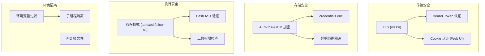

# 09 - 安全分析

## 安全架构概览

Craft Agents 采用多层安全架构，覆盖传输安全、存储安全、执行安全和环境隔离。



---

## S1: 传输安全

### S1.1 TLS 加密
- 远程服务器支持 TLS (PEM 证书)
- 非本地绑定 (`0.0.0.0`) 时强制 TLS，除非显式 `--allow-insecure-bind`
- 支持 `wss://` 协议加密 WebSocket

### S1.2 认证机制
| 场景 | 认证方式 | 安全特性 |
|------|----------|----------|
| CLI / 瘦客户端 | Bearer Token | Token 熵检查 |
| Web UI | Session Cookie | HttpOnly (推测) |
| MCP 连接 | OAuth / Bearer / None | 按源配置 |

### S1.3 Token 安全
- 服务端启动时生成或接收 Token
- 熵检查确保 Token 足够随机
- 握手阶段验证 Token

---

## S2: 存储安全

### S2.1 凭据加密
- **算法**: AES-256-GCM (认证加密)
- **存储位置**: `~/.craft-agent/credentials.enc`
- **Key 格式**: `{type}::{scope}` 实现范围隔离
- **后端抽象**: `SecureStorageBackend` 允许替换实现

### S2.2 凭据范围隔离
```
llm_api_key::anthropic-api     # 仅限 Anthropic API Key
llm_oauth::claude-max           # 仅限 Claude Max OAuth
source_oauth::{wsId}::{srcId}   # 仅限特定工作区的特定源
workspace_oauth::{wsId}         # 仅限特定工作区
```

### S2.3 凭据健康检查
- 检测 `file_corrupted` (文件损坏)
- 检测 `decryption_failed` (机器迁移导致)
- 检测 `no_default_credentials` (缺少默认凭据)

### S2.4 凭据迁移
- 启动时自动从旧格式迁移到新格式
- `claude_oauth::global` → `llm_oauth::claude-max`
- `anthropic_api_key::global` → `llm_api_key::anthropic-api`

---

## S3: 执行安全

### S3.1 权限模式系统
| 模式 | 允许的操作 | 阻止的操作 |
|------|-----------|-----------|
| `safe` (Explore) | Read, Glob, Grep, WebFetch, WebSearch, LSP | Write, Edit, MultiEdit, NotebookEdit |
| `ask` (Ask to Edit) | 所有工具 (UI 提示确认) | - |
| `allow-all` (Auto) | 所有工具自动批准 | - |

### S3.2 Bash 命令验证
使用 `bash-parser` AST 分析：
- **阻止的重定向**: `>`, `>>`, `<`
- **阻止的管道**: `|`, `&&`, `||`, `&`
- **阻止的替换**: `$()`, `` ` ` ``, `<()`, `>()`
- **复合命令**: 所有子命令都必须通过验证
- **Windows**: PowerShell 验证支持

### S3.3 MCP 工具权限
- Explore 模式下匹配 `readOnlyMcpPatterns` 的工具允许
- 变更操作需要 `ask` 或 `allow-all` 模式

### S3.4 API 工具权限
- GET 请求在 Explore 模式始终允许
- 变更请求需要 `allowedApiEndpoints` 白名单

### S3.5 安全模式写入例外
即使在 Explore 模式也允许写入：
- `plansFolderPath` — Agent 提交计划
- `dataFolderPath` — Agent 数据目录

---

## S4: 环境隔离

### S4.1 MCP 子进程环境过滤
本地 MCP 服务器启动时自动过滤敏感环境变量：

**阻止的变量**:
- `ANTHROPIC_API_KEY`, `CLAUDE_CODE_OAUTH_TOKEN`
- `AWS_ACCESS_KEY_ID`, `AWS_SECRET_ACCESS_KEY`, `AWS_SESSION_TOKEN`
- `GITHUB_TOKEN`, `GH_TOKEN`
- `OPENAI_API_KEY`, `GOOGLE_API_KEY`
- `STRIPE_SECRET_KEY`, `NPM_TOKEN`

**显式传递**: 通过源配置 `env` 字段可以显式传递特定变量。

### S4.2 进程隔离
- **Agent 后端**: 子进程运行 (Claude SDK / Pi SDK)
- **MCP 服务器**: Stdio 子进程，环境隔离
- **Pi Agent Server**: 独立进程，JSONL over stdin/stdout 通信

### S4.3 PID 锁文件
- 防止多个服务器实例同时运行
- 自动检测和清理过期锁

---

## S5: 潜在安全风险

### S5.1 已识别风险

| 风险 | 严重度 | 缓解措施 | 状态 |
|------|--------|----------|------|
| 本地存储凭据泄露 | 中 | AES-256-GCM 加密 | 已缓解 |
| MCP 子进程提权 | 中 | 环境变量过滤 | 已缓解 |
| 远程服务器未加密 | 高 | 强制 TLS + Token | 已缓解 |
| Bash 命令注入 | 高 | AST 验证 + 权限模式 | 已缓解 |
| XSS (渲染进程) | 低 | Electron contextBridge | 已缓解 |

### S5.2 建议增强

| 建议 | 优先级 | 描述 |
|------|--------|------|
| 凭据轮换 | P2 | 支持定期自动轮换 API Key |
| 审计日志 | P2 | 记录所有权限决策和工具调用 |
| CSP 头 | P3 | Web UI 添加 Content-Security-Policy |
| 速率限制 | P2 | RPC 请求速率限制 |

## 待确认项

| ID | 内容 | 置信度 | 建议操作 |
|----|------|--------|----------|
| TC-901 | Cookie 安全属性 (HttpOnly/Secure) | ⚠️ [待确认] | 验证 Web UI Cookie 设置 |
| TC-902 | 凭据加密密钥管理 | ⚠️ [待确认] | 确认密钥派生方式 |
| TC-903 | Electron contextIsolation | ⚠️ [待确认] | 确认沙箱配置 |
